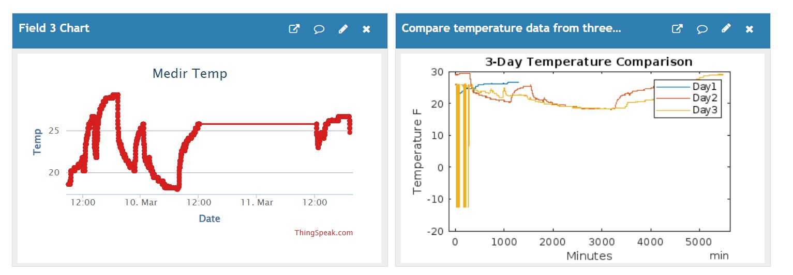

# IOT---Temp
## Introduccion

Este proyecto se centra en la recopilación y visualización de datos de temperatura utilizando un dispositivo IoT equipado con un sensor de temperatura y la plataforma ThingSpeak para el almacenamiento en la nube. El objetivo es proporcionar una solución práctica para monitorear y analizar las variaciones de temperatura en un entorno específico a lo largo del tiempo. La integración de MATLAB permite visualizar y comparar estos datos de manera eficiente para obtener información significativa sobre patrones y tendencias térmicas.

## Instrucciones

Para el Dispositivo IoT:
1. Conexión de Hardware:

- Conecta el sensor de temperatura (DHT11) a tu placa de desarrollo compatible con Arduino.
- Asegúrate de tener una conexión estable a una red Wi-Fi.
  
2. Configuración del Código:

- Abre el IDE de Arduino y crea un nuevo sketch.
- Copia y pega el código proporcionado en el sketch (sketch_feb26a.ino).
- Reemplaza las variables ssid, password, y thingSpeakApiKey con los correspondientes a tu red Wi-Fi y tu cuenta de ThingSpeak.
- Sube el sketch a tu dispositivo IoT.

Para MATLAB:
1. Configuración Inicial:
- Asegúrate de tener MATLAB instalado en tu computadora.
- Abre MATLAB.

2. Código MATLAB:
- Copia y pega el código MATLAB proporcionado en un nuevo script de MATLAB.
  
3. Configuración del Canal ThingSpeak:
- Abre un navegador web y ve a ThingSpeak.
- Crea un nuevo canal y asigna un nombre significativo.
- Define un campo para la temperatura y guarda los cambios.
- Anota el ID del canal y la clave API de lectura.

4. Actualización del Código MATLAB:
- Reemplaza readChannelID con el ID de tu canal de ThingSpeak.
- Reemplaza readAPIKey con tu clave API de lectura.

5. Ejecución del Script MATLAB:
- Ejecuta el script MATLAB.
- Verifica que MATLAB pueda acceder a Internet y a ThingSpeak.
- Deberías obtener datos de temperatura para los tres días especificados.

6. Visualización de Datos:
- Después de ejecutar el script, deberías ver un gráfico que muestra la comparación de temperaturas durante los tres días especificados.
- El eje X representa el tiempo en minutos y el eje Y representa la temperatura en grados Fahrenheit.

### Consideraciones:
- Asegúrate de que el dispositivo IoT esté activo y enviando datos a ThingSpeak correctamente antes de ejecutar el script de MATLAB.
- Verifica que la placa de desarrollo utilizada para el dispositivo IoT sea compatible con las librerías y el código proporcionados.
- Ajusta los intervalos de tiempo y otras configuraciones según sea necesario para adaptarse a tus requerimientos específicos.

## Resultados

